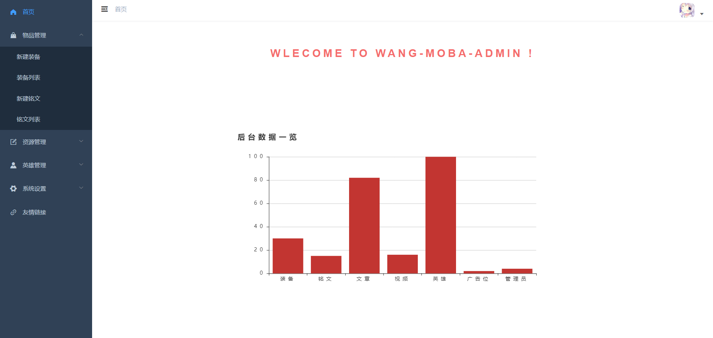

# wang-moba

wang-moba是使用 Node.js (Express.js) + Vue.js (Element UI) 全栈开发的王者荣耀手机端官网和管理后台项目

wang-moba是参考 bilibili全站之巅 教程而开发的，并在此基础上完善了许多功能和细节，在此感谢大佬的教程！

课程地址：<https://www.bilibili.com/video/BV1A4411Y7fi>

项目已上线，欢迎体验！<https://moba.geniusye.xyz>

如果对你有帮助话的帮忙点个star，谢谢！

## 项目布局

```
admin  -- 后台项目
web    -- 前台项目
server -- 服务端
└── admin-api -- 后台管理系统的接口
    ├── handle.js -- 路由处理
    ├── router.js -- 路由定义
├── models -- 数据库模型
├── public -- 静态资源文件
└── upload -- 上传文件保存目录
    ├── images -- 存放上传图片
    ├── video -- 存放上传视频
├── utils -- 工具类
└── web-api -- 前台项目的接口
    ├── handle.js -- 路由处理
    ├── router.js -- 路由定义
├── app.js -- 项目入口文件
```

## 后台管理

1. 装备管理
2. 铭文管理
3. 文章管理
4. 视频管理
5. 英雄管理
6. 分类管理
7. 广告位管理
8. 管理员管理




## 前台项目


## 许可证

MIT license

Copyright (c) [2020] [name of copyright yuchuangye]

